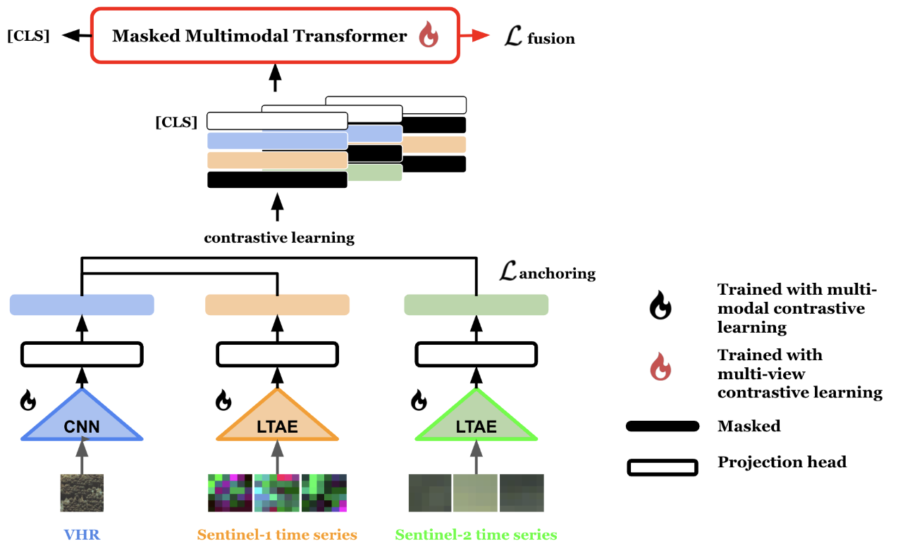

<div align="center">
<h1>ADAPT: Anchored Multimodal Physiological Transformer</h1>
<a href="https://www.python.org/"></a>
<a href="https://pytorch.org/get-started/locally/"></a>
<a href="https://pytorchlightning.ai/"></a>
<a href="https://hydra.cc/"></a>
</div>

Inspired by ADAPT [[Paper]](https://openreview.net/pdf?id=WDZg4P97gr) and OmniSat [[Paper]](https://arxiv.org/pdf/2404.08351)




# Project Structure
```
├── configs                      Hydra configs
│   ├── machine                  Machine configs (gpu, ...)
│   ├── model                    Model cfg
│   ├── multimodal               Data configs
│   ├── paths                    Project paths configs
│   ├── config.yaml              Main config for training
│   ├── PT_ADAPT.yaml            Main config for training on PastisHD
│   ├── TS_ADAPT.yaml            Main config for training on TreeSAT-AI
│   └── video-extract.yaml       Config for video feature extraction 
│
├── src                    
│   ├── datamodule                Data
│   │   ├── datasets             
│   │   └── multimodal_datamodule.py        
│   │
│   ├── models   
|   |   ├── modules               Modules used in the model
|   |   ├── encoders              Encoders for earth observation data
|   |   ├── losses                Loss functions for downstream tasks
|   |   └── adapt.py              ADAPT model       
│   │     
│   └── utils   
│       ├── evaluation          
|       ├── preprocessing     
|       └── training                  
│
├── .gitignore                   List of files ignored by git
├── requirements.txt             File for installing python dependencies
├── train.py                     Main script for training
├── License                      
└── README.md
```

# 🚀 Quickstart
## Set-Up the environment
- Install Anaconda or MiniConda
- Run `conda create -n multi python=3.9`
- Activate multi: `conda activate multi`
- Install pytorch 1.12 and torchvision 0.13 that match your device
    - For GPU: 
    `conda install pytorch==1.12.0 torchvision==0.13.0 cudatoolkit=11.6 -c pytorch -c conda-forge`
- Dependencies apart from `pytorch` may be install with the `pip isntall -r requirements.txt`.

## Prepare the data
- For the dataset, $\texttt{TreeSAT-AI}$ information and data request can be found [here](https://huggingface.co/datasets/IGNF/TreeSatAI-Time-Series).
- Put the data in a directory called "misc/TreeSat"
- Change the path in the cfg/paths/directories.yaml


## Train ADAPT

The code is adapted to wandb logger, if you wish to use a logger make sure to be logged in to wandb before starting.
To run the code on TreeSAT-AI:

```bash
python train_TS.py
```

To disable the logger:
```bash
python train_TS.py log=False
```
